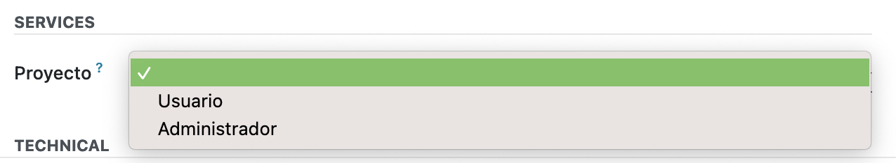

# EMPRESAS CONTRATADORAS 🏢

Modulo de Odoo creado para gestionar los proyectos y tareas de una emrpresa en concreto.

  

## HECHO EN 🔨 

`[Odoo]` , `[PostgreSQL]` & `[Docker]`.

  

### TENER EN CUENTA ⁉️
* Al crear un usuario recuerda no darle permisos de ningún tipo en "Proyecto", ya que por defecto esta en "Administrador" y de esa manera la gestión de roles no hará su trabajo.

    

  

## INFORMACIÓN DEL PROYECTO 📊

### ENTIDADES 📝
* Empresas-contratadoras: Que encargan proyectos a la empresa.

* Proyectos: Aplicaciones informáticas.

* Tareas: Acciones que un jefe de proyectos considera necesarias para realizar un proyecto concreto.

* Subtareas: Acciones que un analista considera necesarias para realizar una tarea.               

### ROLES DE USARIOS 👥
* Administrador: Es el desarrollador de la aplicación. Tiene permiso para todo. Este perfil no opera en la gestión diaria de la empresa. Sólo tiene una función de ajuste y parametrización de la aplicación de gestión.

* Jefe de proyectos: Crean empresas-contratadoras. Crean proyectos. Crean tareas dentro de los proyectos que asignan a los analistas. Pueden modificar proyectos y tareas, aunque no hayan sido creados por ellos 

* Analista: Sólo consultan empresas-contratadoras. Sólo consultan proyectos. Crean tareas dentro de los proyectos que asignan a los programadores.

* Programador: Pueden modificar las tareas. No pueden crearlas ni eliminarlas.
  

### OPERATIVA 📋
* Los Empresas contratadoras encargan Proyectos a nuestra empresa, que son organizados, analizados y finalmente programados por el personal de la empresa.

* Cada proyecto que nos encarguen implica la creación de 1 proyecto en nuestra aplicación.

* En nuestra aplicación deben poderse realizar todas las operaciones que se describen en cada uno de los roles de usuario indicados arriba.
